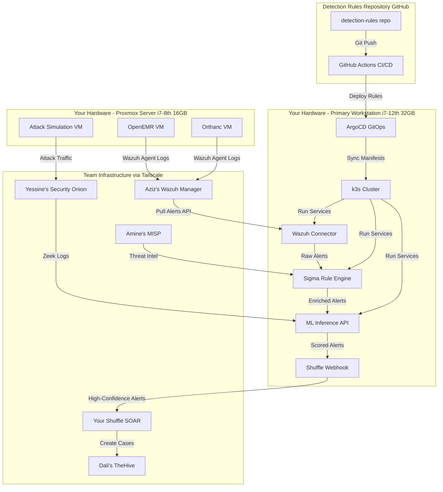
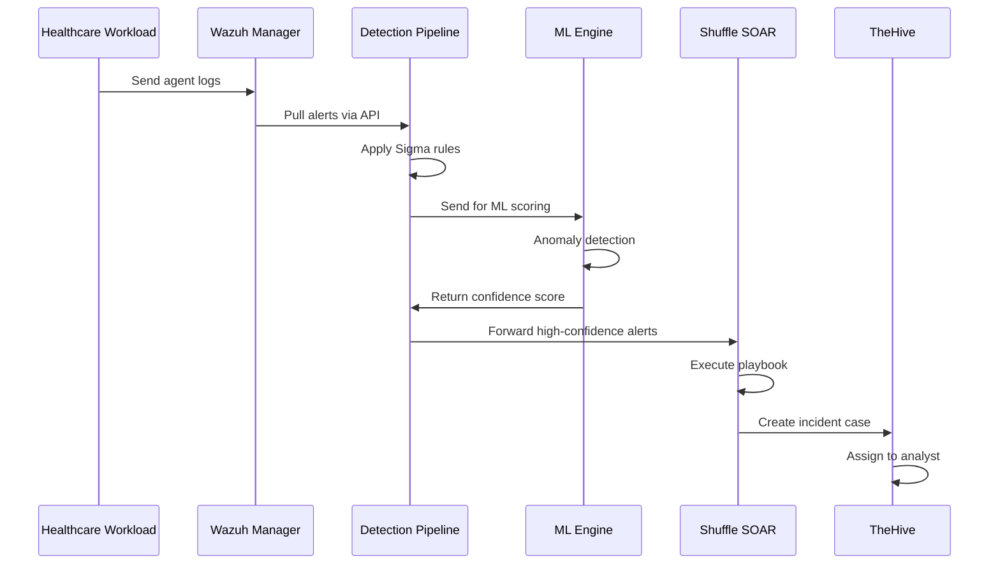
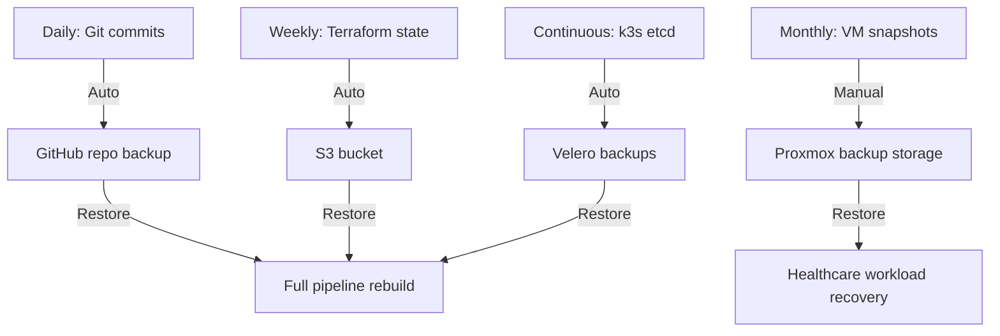

# DevSecOps Detection-as-Code Architecture

## System Overview



## Data Flow



## Component Responsibilities

### Your Components (DevSecOps Layer)

| Component                | Technology             | Purpose                              | Hardware            |
| ------------------------ | ---------------------- | ------------------------------------ | ------------------- |
| **k3s Cluster**          | Lightweight Kubernetes | Container orchestration              | Primary Workstation |
| **ArgoCD**               | GitOps Controller      | Automated deployment from Git        | k3s                 |
| **Sigma Converter**      | sigmac + Custom        | Convert Sigma → Wazuh/Suricata rules | k3s                 |
| **ML Inference API**     | FastAPI + scikit-learn | Real-time anomaly scoring            | k3s                 |
| **Wazuh Connector**      | Python Service         | Pull alerts from team's Wazuh        | k3s                 |
| **Shuffle Webhook**      | Python Service         | Send enriched alerts to SOAR         | k3s                 |
| **Healthcare VMs**       | OpenEMR + Orthanc      | Generate realistic traffic           | Proxmox             |
| **Detection Rules Repo** | GitHub                 | Version-controlled rules + CI/CD     | Cloud               |

### Team Components (You Integrate With)

| Component          | Owner         | Your Integration Point                |
| ------------------ | ------------- | ------------------------------------- |
| **Wazuh Manager**  | Aziz          | Pull alerts via REST API              |
| **Shuffle SOAR**   | You (primary) | Receive enriched alerts from pipeline |
| **TheHive**        | Dali          | Cases created by Shuffle playbooks    |
| **MISP**           | Amine         | Sync IoCs for rule enrichment         |
| **Security Onion** | Yessine       | Consume Zeek logs for ML training     |
| **pfSense HA**     | You + Dali    | Suricata rules deployed from pipeline |

## GitOps Workflow

```mermaid
graph LR
    DEV[Developer] -->|1. Commit Sigma Rule| GIT[GitHub Repo]
    GIT -->|2. Trigger| CI[GitHub Actions]
    CI -->|3. Validate Syntax| TEST[Rule Tests]
    TEST -->|4. If Pass| BUILD[Build Container]
    BUILD -->|5. Push Image| REG[Container Registry]
    REG -->|6. Update Manifest| GITOPS[ArgoCD]
    GITOPS -->|7. Detect Drift| K3S[k3s Cluster]
    K3S -->|8. Deploy| PROD[Production]
    PROD -->|9. Reload Rules| WAZUH[Wazuh Manager]
```



## Network Topology

```
┌─────────────────────────────────────────────────────────────┐
│                    Internet / WAN                            │
└────────────────────────┬────────────────────────────────────┘
                         │
                    ┌────▼─────┐
                    │ pfSense  │ (Your HA Cluster)
                    │ Primary  │
                    └────┬─────┘
                         │
        ┌────────────────┼────────────────┐
        │                │                │
   ┌────▼─────┐    ┌────▼─────┐    ┌────▼─────┐
   │   DMZ    │    │ Hospital │    │ Honeynet │
   │ Network  │    │ Network  │    │ Network  │
   └──────────┘    └────┬─────┘    └──────────┘
                        │
                   ┌────▼─────┐
                   │ IPFire   │ (Aziz's Internal FW)
                   └────┬─────┘
                        │
        ┌───────────────┼───────────────┐
        │               │               │
   ┌────▼─────┐    ┌───▼────┐    ┌─────▼─────┐
   │   LAN    │    │  SOC   │    │  Backup   │
   │ Network  │    │ Network│    │  Network  │
   └──────────┘    └───┬────┘    └───────────┘
                       │
              ┌────────┼────────┐
              │        │        │
         ┌────▼───┐ ┌─▼────┐ ┌─▼─────┐
         │ Wazuh  │ │Shuffle│ │Grafana│
         │(Aziz)  │ │(You)  │ │(Salsa)│
         └────────┘ └───────┘ └───────┘

All connected via Tailscale mesh overlay network
```

## Storage Architecture

```
Primary Workstation (1TB SSD):
├── /k3s-data/              (100GB) - k3s cluster persistent volumes
├── /detection-rules/       (10GB)  - Git repo clone
├── /ml-models/            (20GB)  - Trained models + datasets
├── /logs/                 (50GB)  - Pipeline logs (30-day retention)
└── /pfSense-HA/           (50GB)  - Your primary pfSense VM

Proxmox Server (1TB 50% SSD / 50% HDD):
├── SSD:
│   ├── /openemr-vm/       (100GB) - Fast DB access
│   └── /orthanc-vm/       (100GB) - DICOM storage
└── HDD:
    ├── /attack-vm/        (50GB)  - Attack simulation
    └── /backups/          (300GB) - VM snapshots
```

## Security Boundaries

| Zone                   | Trust Level | Access Control             | Monitoring             |
| ---------------------- | ----------- | -------------------------- | ---------------------- |
| **k3s Cluster**        | High        | mTLS between pods, RBAC    | Falco runtime security |
| **Healthcare VMs**     | Medium      | Wazuh agents, OS hardening | Full EDR telemetry     |
| **Detection Pipeline** | High        | API keys, network policies | Audit logs to Wazuh    |
| **Team Integration**   | Medium      | Tailscale ACLs, API tokens | Connection monitoring  |

## Disaster Recovery



## Performance Targets

| Metric                       | Target           | Measurement                    |
| ---------------------------- | ---------------- | ------------------------------ |
| **Alert Enrichment Latency** | <5 seconds       | Wazuh alert → Shuffle webhook  |
| **Rule Deployment Time**     | <2 minutes       | Git commit → Production active |
| **ML Inference Throughput**  | >1000 alerts/min | Batch processing capacity      |
| **False Positive Rate**      | <10%             | Weekly review of Shuffle cases |
| **Pipeline Uptime**          | >99%             | Prometheus monitoring          |

## Scalability Plan

### Current (Week 1-10)
- Single k3s node
- 3 ML models
- 50 Sigma rules
- 1000 alerts/day

### Mid-term (Week 11-21)
- 2 k3s nodes (add Proxmox as worker)
- 5 ML models
- 100+ Sigma rules
- 5000 alerts/day

### Future (Post-graduation)
- Multi-node k3s cluster
- 10+ ML models
- 200+ Sigma rules
- 10000+ alerts/day
- Team can replicate for production use
